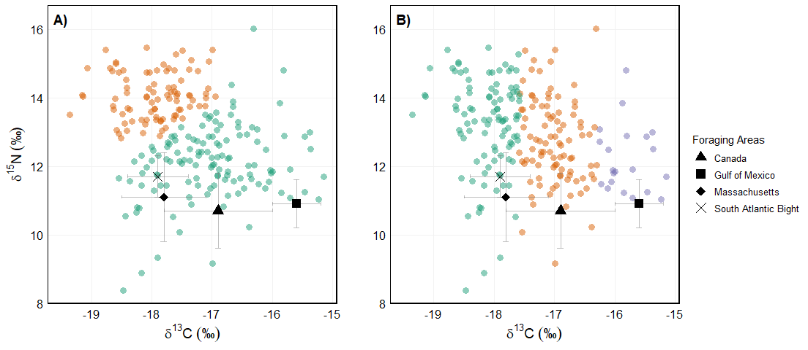
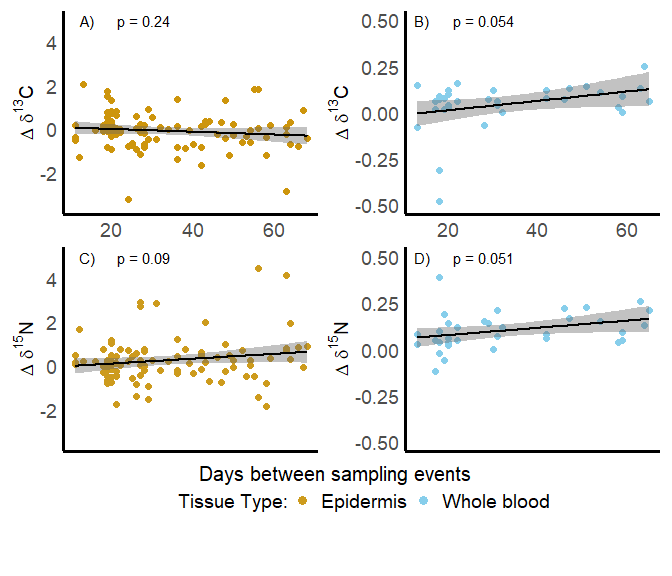
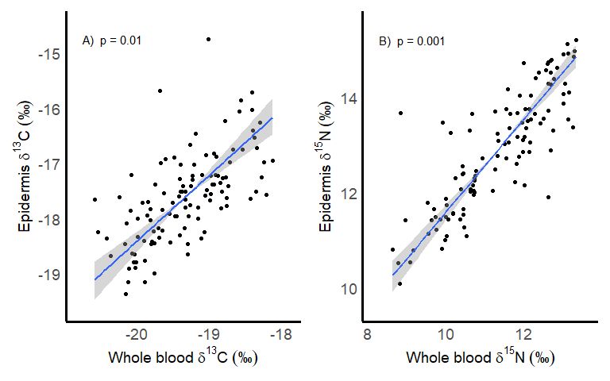

[Florida_Dc_SIA_manuscript_clean_Jan_2026_github.md](https://github.com/user-attachments/files/25156370/Florida_Dc_SIA_manuscript_clean_Jan_2026_github.md)
A comparison of stable isotope values in epidermis and blood of nesting
leatherback sea turtles in the Northwest Atlantic Ocean
================
2026-02-07

## Leatherback isotope analyses

This is a RMarkdown document outlining the data processing and analyses
of isotopes for carbon and nitrogen of nesting leatherback sea turtles
nesting in Juno Beach, Florida. We used stable isotope analysis of
epidermis, whole blood, and RBCs to investigate the habitat-use patterns
of nesting leatherback sea turtles in Florida, USA. By analyzing stable
carbon (𝛿¹³C) and nitrogen (𝛿¹⁵N) values, we aimed to examine the
isotopic variability as a proxy for foraging area diversity.
Furthermore, we assessed isotopic variability in both epidermis and
blood across the nesting season to determine whether tissue isotope
values remained stable or fluctuated because of potential physiological
changes, fasting, or other metabolic processes. Finally, we examined the
isotopic relationship between different tissue types to facilitate
cross-study comparisons. Understanding these dynamics is important for
the application of stable isotopes in ecological monitoring,
particularly when using these data to infer long-term habitat use. .

The various steps that will be performed are:

1: Load data

2: Examine differences between seasons and plot all samples for season
and tissue type

3: Perform cluster analyses for epidermis and whole blood separately

4: Look at changes in isotopic values for the same individual within a
nesting season

5: Compare the isotopic relationship between whole blood and epidermis

6: Comparison of C:N ratio and carbon 13

## Load Required Libraries

``` r
library(gridExtra)
library(cowplot)
library(patchwork)
library(ggpubr)
library(ggpmisc)
library(stringr)
library(DT)
library(vegan)
library(cluster)
library(mclust)
library(kableExtra)
library(viridis)
library(RColorBrewer)
library(glue)
library(nlme)
library(lmodel2)
library(car)
library(pairwiseAdonis)
library(broom)
library(grid)
library(tidyverse)
library(emmeans)
library(multcomp)
library(conflicted)
conflicts_prefer(
  dplyr::select,
  dplyr::filter,
  DT::datatable,
  ggplot2::annotate,
  cowplot::get_legend
)
```

## 1: Import data for use and basic statistics on sample size

This project includes datasets from two studies at the same beach and
processed in the same isotope lab at the University of Florida.

``` r
sia <- read.csv("Florida_Dc_Isotope_data_Cop_Nol_first_last.csv") %>%
  select(-c(Sample))
```

``` r
DT::datatable(
  sia,
  options = list(pageLength = 10, order = list(list(1, 'asc')))
)
```

The columns are as follows:

``` r
metadata_table <- tibble::tribble(
  ~Variable, ~Description,
  "Year", "Calendar year in which the sample was collected.",
  "Date", "Date of sample collection (MM/DD/YYYY).",
  "Julian_Day", "Julian day corresponding to the sampling date (1–365/366), used to quantify timing within the nesting season.",
  "Turtle_ID", "Unique identifier assigned to each individual leatherback sea turtle.",
  "d13C", "Stable carbon isotope ratio (δ¹³C, ‰) of the tissue sample relative to the Vienna Pee Dee Belemnite (VPDB) standard.",
  "d15N", "Stable nitrogen isotope ratio (δ¹⁵N, ‰) of the tissue sample relative to atmospheric nitrogen (AIR).",
  "PerC", "Percent carbon (%C) content of the tissue sample by dry mass.",
  "PerN", "Percent nitrogen (%N) content of the tissue sample by dry mass.",
  "CN_ratio", "Atomic carbon-to-nitrogen (C:N) ratio of the tissue sample, used as a proxy for lipid content.",
  "Tissue_type", "Tissue sampled from the turtle: epidermis (EPI), whole blood (WB), or red blood cells (RBC)."
)

kable(
  metadata_table,
  caption = "Metadata descriptions for variables included in the stable isotope dataset of nesting leatherback sea turtles."
)
```

| Variable    | Description                                                                                                          |
|:------------|:---------------------------------------------------------------------------------------------------------------------|
| Year        | Calendar year in which the sample was collected.                                                                     |
| Date        | Date of sample collection (MM/DD/YYYY).                                                                              |
| Julian_Day  | Julian day corresponding to the sampling date (1–365/366), used to quantify timing within the nesting season.        |
| Turtle_ID   | Unique identifier assigned to each individual leatherback sea turtle.                                                |
| d13C        | Stable carbon isotope ratio (δ¹³C, ‰) of the tissue sample relative to the Vienna Pee Dee Belemnite (VPDB) standard. |
| d15N        | Stable nitrogen isotope ratio (δ¹⁵N, ‰) of the tissue sample relative to atmospheric nitrogen (AIR).                 |
| PerC        | Percent carbon (%C) content of the tissue sample by dry mass.                                                        |
| PerN        | Percent nitrogen (%N) content of the tissue sample by dry mass.                                                      |
| CN_ratio    | Atomic carbon-to-nitrogen (C:N) ratio of the tissue sample, used as a proxy for lipid content.                       |
| Tissue_type | Tissue sampled from the turtle: epidermis (EPI), whole blood (WB), or red blood cells (RBC).                         |

Metadata descriptions for variables included in the stable isotope
dataset of nesting leatherback sea turtles.

Count the number of unique turtles and how many were sampled at least
twice.

``` r
# Blood: WB + RBC combined, ignore year
blood_turtles <- sia %>%
  filter(Tissue_type %in% c("WB", "RBC")) %>%
  group_by(Turtle_ID) %>%
  summarise(n_samples = n(), .groups = "drop") %>%
  filter(n_samples >= 2) %>%
  summarise(n_unique_turtles = n_distinct(Turtle_ID)) %>%
  pull(n_unique_turtles)

# Skin: EPI, ignore year
skin_turtles <- sia %>%
  filter(Tissue_type == "EPI") %>%
  group_by(Turtle_ID) %>%
  summarise(n_samples = n(), .groups = "drop") %>%
  filter(n_samples >= 2) %>%
  summarise(n_unique_turtles = n_distinct(Turtle_ID)) %>%
  pull(n_unique_turtles)

cat("Unique number of turtles sampled at least twice for blood:", blood_turtles, "\n")
```

    ## Unique number of turtles sampled at least twice for blood: 44

``` r
cat("Unique number of turtles sampled at least twice for epidermis:", skin_turtles, "\n")
```

    ## Unique number of turtles sampled at least twice for epidermis: 111

Make a table showing how many samples there were per season for each
tissue type and in brackets show how many repeats there were for each
season.

``` r
# Build summary: Unique turtles and repeats per Year × Tissue_type
sample_summary_wide <- sia %>%
  group_by(Year, Tissue_type) %>%
  summarise(
    Total_Samples  = n(),
    Unique_Turtles = n_distinct(Turtle_ID),
    Repeats        = Total_Samples - Unique_Turtles,
    .groups = "drop"
  ) %>%
  mutate(Summary = paste0(Unique_Turtles, " (", Repeats, ")")) %>%  # show Unique (Repeats)
  select(Year, Tissue_type, Summary) %>%
  arrange(Year, Tissue_type) %>%
  pivot_wider(names_from = Tissue_type, values_from = Summary)

# Totals row across all years
totals_row <- sia %>%
  group_by(Tissue_type) %>%
  summarise(
    Total_Samples  = n(),
    Unique_Turtles = n_distinct(Turtle_ID),
    Repeats        = Total_Samples - Unique_Turtles,
    .groups = "drop"
  ) %>%
  mutate(Summary = paste0(Unique_Turtles, " (", Repeats, ")")) %>%
  select(Tissue_type, Summary) %>%
  pivot_wider(names_from = Tissue_type, values_from = Summary) %>%
  mutate(Year = "Total")

# Bind totals, fix Year type, and order with Total last
sample_summary_wide <- sample_summary_wide %>%
  mutate(Year = as.character(Year)) %>%
  bind_rows(totals_row) %>%
  mutate(Year = factor(Year, levels = c(sort(unique(sample_summary_wide$Year)), "Total"))) %>%
  arrange(Year)

# Display table
kable(sample_summary_wide,
      caption = "Unique turtles per year and tissue (repeats in brackets).",
      align = "c") %>%
  kable_styling(full_width = FALSE, position = "center")
```

<table class="table" style="width: auto !important; margin-left: auto; margin-right: auto;">
<caption>
Unique turtles per year and tissue (repeats in brackets).
</caption>
<thead>
<tr>
<th style="text-align:center;">
Year
</th>
<th style="text-align:center;">
EPI
</th>
<th style="text-align:center;">
WB
</th>
<th style="text-align:center;">
RBC
</th>
</tr>
</thead>
<tbody>
<tr>
<td style="text-align:center;">
2014
</td>
<td style="text-align:center;">
14 (0)
</td>
<td style="text-align:center;">
10 (1)
</td>
<td style="text-align:center;">
NA
</td>
</tr>
<tr>
<td style="text-align:center;">
2015
</td>
<td style="text-align:center;">
8 (0)
</td>
<td style="text-align:center;">
11 (0)
</td>
<td style="text-align:center;">
NA
</td>
</tr>
<tr>
<td style="text-align:center;">
2016
</td>
<td style="text-align:center;">
29 (2)
</td>
<td style="text-align:center;">
26 (4)
</td>
<td style="text-align:center;">
NA
</td>
</tr>
<tr>
<td style="text-align:center;">
2017
</td>
<td style="text-align:center;">
24 (7)
</td>
<td style="text-align:center;">
20 (3)
</td>
<td style="text-align:center;">
NA
</td>
</tr>
<tr>
<td style="text-align:center;">
2018
</td>
<td style="text-align:center;">
56 (29)
</td>
<td style="text-align:center;">
NA
</td>
<td style="text-align:center;">
NA
</td>
</tr>
<tr>
<td style="text-align:center;">
2019
</td>
<td style="text-align:center;">
62 (21)
</td>
<td style="text-align:center;">
NA
</td>
<td style="text-align:center;">
NA
</td>
</tr>
<tr>
<td style="text-align:center;">
2020
</td>
<td style="text-align:center;">
45 (25)
</td>
<td style="text-align:center;">
NA
</td>
<td style="text-align:center;">
NA
</td>
</tr>
<tr>
<td style="text-align:center;">
2021
</td>
<td style="text-align:center;">
41 (28)
</td>
<td style="text-align:center;">
43 (31)
</td>
<td style="text-align:center;">
NA
</td>
</tr>
<tr>
<td style="text-align:center;">
2022
</td>
<td style="text-align:center;">
4 (0)
</td>
<td style="text-align:center;">
NA
</td>
<td style="text-align:center;">
19 (0)
</td>
</tr>
<tr>
<td style="text-align:center;">
Total
</td>
<td style="text-align:center;">
216 (179)
</td>
<td style="text-align:center;">
100 (49)
</td>
<td style="text-align:center;">
19 (0)
</td>
</tr>
</tbody>
</table>

## 2: Examine isotopic difference in tissue type

Calculate the average, standard deviation and number of samples for each
tissue type

**Overall statistics**

``` r
overall_stats <- sia %>%
  summarise(
    d13C_mean = mean(d13C, na.rm = TRUE),
    d13C_sd   = sd(d13C, na.rm = TRUE),
    d13C_min  = min(d13C, na.rm = TRUE),
    d13C_max  = max(d13C, na.rm = TRUE),
    
    d15N_mean = mean(d15N, na.rm = TRUE),
    d15N_sd   = sd(d15N, na.rm = TRUE),
    d15N_min  = min(d15N, na.rm = TRUE),
    d15N_max  = max(d15N, na.rm = TRUE)
  )

overall_stats
```

    ##   d13C_mean d13C_sd d13C_min d13C_max d15N_mean d15N_sd d15N_min d15N_max
    ## 1    -18.03   1.109   -20.58   -13.94     12.62   1.553     8.38    17.85

``` r
# Compute summary statistics for each Tissue_type
tissue_summary <- sia %>%
  group_by(Tissue_type) %>%
  summarise(
    n = n(),  # Sample size
    d13C = paste0(round(mean(d13C, na.rm = TRUE), 3), " ± ", round(sd(d13C, na.rm = TRUE), 3)),
    d15N = paste0(round(mean(d15N, na.rm = TRUE), 3), " ± ", round(sd(d15N, na.rm = TRUE), 3)),
    C_N = paste0(round(mean(CN_ratio, na.rm = TRUE), 3), " ± ", round(sd(CN_ratio, na.rm = TRUE), 3))  # Corrected here
  )
```

``` r
# Display the summary as an interactive table
DT::datatable(
  tissue_summary,
  options = list(pageLength = 10, order = list(list(1, 'asc'))),
  caption = "Table 2: Sample count and mean carbon (𝛿13C) and nitrogen (𝛿15N) isotope values from nesting leatherback sea turtles (Dermochelys coriacea) in Juno and Jupiter Beaches, Florida, USA during the 2014–2022 nesting seasons. Three different tissue types were collected: epidermis, red blood cells, and whole blood."
)
```

**Permanova for differences in tissue type**

``` r
permanova_tissue <- adonis2(
  cbind(sia$d13C, sia$d15N) ~ Tissue_type,
  data = sia,
  method = "euclidean",
  permutations = 999
)

permanova_tissue
```

    ## Permutation test for adonis under reduced model
    ## Permutation: free
    ## Number of permutations: 999
    ## 
    ## adonis2(formula = cbind(sia$d13C, sia$d15N) ~ Tissue_type, data = sia, permutations = 999, method = "euclidean")
    ##           Df SumOfSqs    R2   F Pr(>F)    
    ## Model      2      755 0.369 164  0.001 ***
    ## Residual 560     1292 0.631               
    ## Total    562     2047 1.000               
    ## ---
    ## Signif. codes:  0 '***' 0.001 '**' 0.01 '*' 0.05 '.' 0.1 ' ' 1

**Permanova for differences in epidermis by year**

``` r
epi_data <- sia %>% filter(Tissue_type == "EPI") %>%
  mutate(Year = factor(Year))

permanova_epi_year <- adonis2(
  cbind(epi_data$d13C, epi_data$d15N) ~ Year,
  data = epi_data,
  method = "euclidean",
  permutations = 999
)

permanova_epi_year
```

    ## Permutation test for adonis under reduced model
    ## Permutation: free
    ## Number of permutations: 999
    ## 
    ## adonis2(formula = cbind(epi_data$d13C, epi_data$d15N) ~ Year, data = epi_data, permutations = 999, method = "euclidean")
    ##           Df SumOfSqs    R2    F Pr(>F)    
    ## Model      8      103 0.109 5.88  0.001 ***
    ## Residual 386      850 0.891                
    ## Total    394      953 1.000                
    ## ---
    ## Signif. codes:  0 '***' 0.001 '**' 0.01 '*' 0.05 '.' 0.1 ' ' 1

**Permanova for differences in whole blood by year**

``` r
wb_data <- sia %>% filter(Tissue_type == "WB") %>%
  mutate(Year = factor(Year))

permanova_wb_year <- adonis2(
  cbind(wb_data$d13C, wb_data$d15N) ~ Year,
  data = wb_data,
  method = "euclidean",
  permutations = 999
)

permanova_wb_year
```

    ## Permutation test for adonis under reduced model
    ## Permutation: free
    ## Number of permutations: 999
    ## 
    ## adonis2(formula = cbind(wb_data$d13C, wb_data$d15N) ~ Year, data = wb_data, permutations = 999, method = "euclidean")
    ##           Df SumOfSqs    R2    F Pr(>F)    
    ## Model      4     94.3 0.306 15.8  0.001 ***
    ## Residual 144    214.2 0.694                
    ## Total    148    308.5 1.000                
    ## ---
    ## Signif. codes:  0 '***' 0.001 '**' 0.01 '*' 0.05 '.' 0.1 ' ' 1

Do ANOVAs for all the tissue types and isotopes to see which years are
different from each other.

``` r
# Make sure Year is treated as a factor for the ANOVA
epi_data$Year <- as.factor(epi_data$Year)

# Perform ANOVA for d13C epidermis
anova_d13c_epi <- aov(d13C ~ Year, data = epi_data)

# Print the summary of the ANOVA
summary(anova_d13c_epi)
```

    ##              Df Sum Sq Mean Sq F value Pr(>F)   
    ## Year          8   17.2    2.15    3.16 0.0018 **
    ## Residuals   386  262.4    0.68                  
    ## ---
    ## Signif. codes:  0 '***' 0.001 '**' 0.01 '*' 0.05 '.' 0.1 ' ' 1

``` r
##########################
# Perform ANOVA for d15N
anova_d15n_epi <- aov(d15N ~ Year, data = epi_data)

# Print the summary of the ANOVA
summary(anova_d15n_epi)
```

    ##              Df Sum Sq Mean Sq F value  Pr(>F)    
    ## Year          8     86   10.79    7.09 9.3e-09 ***
    ## Residuals   386    587    1.52                    
    ## ---
    ## Signif. codes:  0 '***' 0.001 '**' 0.01 '*' 0.05 '.' 0.1 ' ' 1

``` r
#########################
# Whole blood
# Make sure Year is treated as a factor for the ANOVA
wb_data$Year <- as.factor(wb_data$Year)

# Perform ANOVA for d13C epidermis
anova_d13c_wb <- aov(d13C ~ Year, data = wb_data)

# Print the summary of the ANOVA
summary(anova_d13c_wb)
```

    ##              Df Sum Sq Mean Sq F value  Pr(>F)    
    ## Year          4    6.6    1.65    5.69 0.00028 ***
    ## Residuals   144   41.8    0.29                    
    ## ---
    ## Signif. codes:  0 '***' 0.001 '**' 0.01 '*' 0.05 '.' 0.1 ' ' 1

``` r
##########################
# Perform ANOVA for d15N
anova_d15n_wb <- aov(d15N ~ Year, data = wb_data)

# Print the summary of the ANOVA
summary(anova_d15n_wb)
```

    ##              Df Sum Sq Mean Sq F value  Pr(>F)    
    ## Year          4   87.7    21.9    18.3 3.5e-12 ***
    ## Residuals   144  172.4     1.2                    
    ## ---
    ## Signif. codes:  0 '***' 0.001 '**' 0.01 '*' 0.05 '.' 0.1 ' ' 1

### Figure 1

``` r
# 1) Prep: filter out RBC for the boxplot panel
df_filtered <- sia %>% dplyr::filter(Tissue_type != "RBC")

df_long <- df_filtered %>%
  pivot_longer(cols = c(d13C, d15N), names_to = "Isotope", values_to = "Value") %>%
  dplyr::mutate(
    Year = factor(Year),
    Tissue_type = factor(Tissue_type, levels = c("EPI", "WB")),
    Isotope = factor(Isotope, levels = c("d13C", "d15N"))
  )

# Create an emmeans object and then generate the CLD
#13C
emm_object_Epi_13C <- emmeans(anova_d13c_epi, ~ Year) %>%
  cld(alpha = 0.05, Letters = LETTERS) %>% cbind(TissueType="EPI") # Adjust alpha as needed
emm_object_WB_13C <- emmeans(anova_d13c_wb, ~ Year) %>%
  cld(alpha = 0.05, Letters = LETTERS) %>% cbind(TissueType="WB") # Adjust alpha as needed

#15N
emm_object_Epi_15N <- emmeans(anova_d15n_epi, ~ Year) %>%
  cld(alpha = 0.05, Letters = LETTERS) %>% cbind(TissueType="EPI") # Adjust alpha as needed
emm_object_WB_15N <- emmeans(anova_d15n_wb, ~ Year) %>%
  cld(alpha = 0.05, Letters = LETTERS) %>% cbind(TissueType="WB") # Adjust alpha as needed

p_d13C <- ggplot(dplyr::filter(df_long, Isotope == "d13C"),
                 aes(x = Year, y = Value, color = Tissue_type, fill = Tissue_type, alpha = 0.5)) +
  geom_boxplot(position = position_dodge2(width = 0.8, preserve = "single", padding = 0.3),
               width = 0.6, outlier.shape = 16, outlier.size = 1.8) +
  labs(x = NULL, y = bquote(delta^13*C ~ ("\u2030"))) +   # remove x-axis label
  scale_color_manual(values = c("EPI" = "darkgoldenrod3", "WB" = "skyblue")) +
  scale_fill_manual(values = c("EPI" = "darkgoldenrod3", "WB" = "skyblue")) +
  theme_minimal() +
  theme(
    panel.grid.major = element_line(color = "grey95", linewidth = 0.1),
    panel.grid.minor = element_blank(),
    axis.text.x = element_blank(),   # remove tick labels
    axis.ticks.x = element_blank(),  # remove tick marks
    legend.position = "none") +
  ggplot2::annotate(geom = "text", x = 0.8, y = -13, label = "B)") +
  geom_text(data=emm_object_Epi_13C, inherit.aes = F,
            aes(Year, emmean+2.5, label=.group, color=TissueType), 
            size=2.5, hjust=0.5, fontface="bold") +
  geom_text(data=emm_object_WB_13C, inherit.aes = F,
            aes(Year, emmean-2, label=.group, color=TissueType), 
            size=2.5, hjust=0.5, fontface="bold")

p_d15N <- ggplot(dplyr::filter(df_long, Isotope == "d15N"),
                 aes(x = Year, y = Value, color = Tissue_type, fill = Tissue_type, alpha =0.5)) +
  geom_boxplot(position = position_dodge2(width = 0.8, preserve = "single", padding = 0.3),
               width = 0.6, outlier.shape = 16, outlier.size = 1.8) +
   labs(x = "Year", y = bquote(delta^15*N ~ ("\u2030"))) +
  scale_color_manual(values = c("EPI" = "darkgoldenrod3", "WB" = "skyblue")) +
  scale_fill_manual(values = c("EPI" = "darkgoldenrod3", "WB" = "skyblue")) +
  theme_minimal() +
  theme(    
    panel.grid.major = element_line(color = "grey95", linewidth = 0.1),
    panel.grid.minor = element_blank(),
    axis.text.x = element_text(angle = 45, hjust = 1),
    legend.position = "none") +
  ggplot2::annotate(geom = "text", x = 0.8, y = 18.2, label = "C)") +
  geom_text(data=emm_object_Epi_15N, inherit.aes = F,
            aes(Year, emmean+4, label=.group, color=TissueType), 
            size=2.5, hjust=0.5, fontface="bold") +
  geom_text(data=emm_object_WB_15N, inherit.aes = F,
            aes(Year, emmean-3.5, label=.group, color=TissueType), 
            size=2.5, hjust=0.5, fontface="bold")

# 3) SCATTER plot with custom colors
sia$Tissue_type <- factor(sia$Tissue_type, levels = c("EPI", "WB", "RBC"))

x_limits <- range(sia$d13C, na.rm = TRUE)
y_limits <- range(sia$d15N, na.rm = TRUE)

sia$alpha <- ifelse(sia$Tissue_type == "EPI", 0.3,
                       ifelse(sia$Tissue_type == "WB", 0.5, 0.8))

p_scatter <- ggplot(sia, aes(x = d13C, y = d15N, color = Tissue_type, fill = Tissue_type)) +
  geom_point(aes(alpha = alpha), size = 2) +
  scale_alpha_identity() +
  labs(
    x = bquote(delta^13*C ~ ("\u2030")),
    y = bquote(delta^15*N ~ ("\u2030")),
    color = "Tissue Type",
    fill  = "Tissue Type"
  ) +
  scale_color_manual(values = c("EPI" = "darkgoldenrod3", "WB" = "skyblue", "RBC" = "firebrick2"),
                     labels = c("Epidermis", "Whole blood", "Red blood cells")) +
  scale_fill_manual(values = c("EPI" = "darkgoldenrod3", "WB" = "skyblue", "RBC" = "firebrick2"),
                    labels = c("Epidermis", "Whole blood", "Red blood cells")) +
  coord_cartesian(xlim = x_limits, ylim = y_limits) +
  theme_minimal(base_size = 12) +
  theme(
    panel.grid.major = element_blank(),
    panel.grid.minor = element_blank(),
    axis.text  = element_text(size = 10, color = "black"),
    axis.title = element_text(size = 10, face = "bold"),
    axis.line = element_line(colour = "grey80", linewidth = 0.5),
    legend.position= "bottom",
    legend.justification = c(0.2, 0),
    legend.title = element_text(size = 10),
    legend.text = element_text(size = 10)) +
    guides(color = guide_legend(override.aes = list(size = 3)),  # make points bigger
           ) +
ggplot2::annotate(geom = "text", x = -20.5, y = 18.2, label = "A)")


# 4) Arrange side-by-side
p_scatter + (p_d13C / p_d15N)
```

<!-- -->

**Figure 1:** Stable isotope (𝛿¹³C and 𝛿¹⁵N) values from three tissue
types (epidermis, whole blood, and red blood cells) collected from
nesting leatherback sea turtles (Dermochelys coriacea) at Juno and
Jupiter Beaches, Florida, USA. (A) Values of 𝛿¹³C and 𝛿¹⁵N by tissue
type. (B) Yearly boxplots of 𝛿¹³C values. (C) Yearly boxplots of 𝛿¹⁵N
values. For the boxplots, the horizontal line denotes the median, boxes
span the interquartile range (25th–75th percentiles), whiskers extend to
1.5 × the interquartile range, and points beyond whiskers represent
outliers. Different letters indicate significant pairwise differences (p
\< 0.05) for epidermis and whole blood respectively. Red blood cells
were only collected in 2019 so were not included in the yearly boxplots.

## 3: Perform cluster analyses for epidermis

To ensure that each Turtle_ID is only used once per year, and that if
multiple samples exist in the same year, the later date is discarded,
and filtered accordingly before running clustering.

``` r
# Ensure Date is in Date format
sia_date <- sia %>%
  mutate(Date = suppressWarnings(as.Date(Date, tryFormats = c("%Y-%m-%d", "%m/%d/%Y", "%d-%m-%Y"))))

# Remove second occurrences: Keep the earliest sample per Turtle_ID, Year, and Tissue_type
filtered_data <- sia_date %>%
  filter(Tissue_type == "EPI") %>%
  group_by(Turtle_ID, Year, Tissue_type) %>%
  slice_min(order_by = Date, with_ties = FALSE) %>%  # Keeps the earliest sample
  ungroup() %>%
  drop_na(d13C, d15N)                      # Keep only samples with both isotopes
# Check before & after filtering
cat("Rows before filtering:", nrow(sia_date), "\n")
```

    ## Rows before filtering: 563

``` r
cat("Rows after filtering:", nrow(filtered_data), "\n")
```

    ## Rows after filtering: 283

``` r
# View the combined dataset
DT::datatable(
  filtered_data,
  options = list(pageLength = 10, order = list(list(1, 'asc')))
)
```

To assess the clustering patterns of 𝛿¹³C and 𝛿¹⁵N values across
different tissue types, a model-based clustering approach was
implemented using the mclust package.

### Figure 2

``` r
# ---- PREP REFERENCE DATA ----
reference_data <- data.frame(
  Area = c("Canada", "South Atlantic Bight", "Massachusetts", "Gulf of Mexico"),
  d15N = c(10.7, 11.7, 11.1, 10.9),
  sd_d15N = c(1.1, 0.6, 1.3, 0.7),
  d13C = c(-16.9, -17.9, -17.8, -15.6),
  sd_d13C = c(0.9, 0.5, 0.7, 0.4),
  Shape = c("Canada", "South Atlantic Bight", "Massachusetts", "Gulf of Mexico")
)

# ---- FILTER DATA (one record per turtle) ----
epi_data <- filtered_data %>%
  dplyr::filter(Tissue_type == "EPI") %>%
  dplyr::arrange(Turtle_ID, Year, Date) %>%
  dplyr::group_by(Turtle_ID) %>%
  dplyr::slice(1) %>%
  dplyr::ungroup() %>%
  tidyr::drop_na(d13C, d15N)

# ---- CLUSTERING ----
mod_both <- mclust::Mclust(
  epi_data %>% dplyr::select(d13C, d15N),
  G = 2, modelNames = "VEI"
)
epi_data$Cluster_A <- factor(mod_both$classification)

mod_carbon <- mclust::Mclust(
  epi_data$d13C,
  G = 3, modelNames = "E"
)
epi_data$Cluster_B <- factor(mod_carbon$classification)

# ---- PLOTTING FUNCTION (NO LEGENDS IN PANELS) ----
make_isotope_plot <- function(data, cluster_col, title_label) {
  ggplot2::ggplot() +
    # Clustered turtle data (colored, but legend suppressed)
    ggplot2::geom_point(
      data = data,
      ggplot2::aes(x = d13C, y = d15N, color = .data[[cluster_col]]),
      pch = 16, size = 3, alpha = 0.5
    ) +
    # Reference error bars (vertical: ymin/ymax)
    ggplot2::geom_errorbar(
      data = reference_data,
      ggplot2::aes(
        x = d13C,
        ymin = d15N - sd_d15N,
        ymax = d15N + sd_d15N
      ),
      width = 0.1, color = "grey50", alpha = 0.5
    ) +
    # Reference error bars (horizontal: xmin/xmax)
    ggplot2::geom_errorbarh(
      data = reference_data,
      ggplot2::aes(
        y = d15N,
        xmin = d13C - sd_d13C,
        xmax = d13C + sd_d13C
      ),
      height = 0.1, color = "grey50", alpha = 0.5
    ) +
    # Reference points (shapes)
    ggplot2::geom_point(
      data = reference_data,
      ggplot2::aes(x = d13C, y = d15N, shape = Shape),
      color = "black", size = 4
    ) +
    ggplot2::scale_color_brewer(palette = "Dark2") +
    ggplot2::scale_shape_manual(values = c(17, 15, 18, 4)) +
    ggplot2::labs(
      x = expression(delta^13*C ~ ("\u2030")),
      y = expression(delta^15*N ~ ("\u2030"))
    ) +
    ggplot2::annotate(
      geom = "text", x = -19.5, y = 16.3,
      label = title_label, fontface = "bold", size = 5
    ) +
    ggplot2::theme_minimal() +
    ggplot2::theme(
      panel.grid.major = ggplot2::element_line(color = "grey95", linewidth = 0.1),
      panel.grid.minor = ggplot2::element_blank(),
      panel.border = ggplot2::element_rect(color = "black", fill = NA, linewidth = 1),
      axis.text  = ggplot2::element_text(size = 12, color = "black"),
      axis.title = ggplot2::element_text(size = 14, face = "bold"),
      legend.position = "none"  # <- removes BOTH color and shape legends from panels
    )
}

# ---- BUILD PANELS ----
p1 <- make_isotope_plot(epi_data, "Cluster_A", "A)")
p2 <- make_isotope_plot(epi_data, "Cluster_B", "B)") +
  ggplot2::theme(axis.title.y = ggplot2::element_blank())

# ---- MAKE A SINGLE SHAPE LEGEND (FORAGING AREAS ONLY) ----
legend_plot <- ggplot2::ggplot(
  reference_data,
  ggplot2::aes(x = d13C, y = d15N, shape = Shape)
) +
  ggplot2::geom_point(size = 4, color = "black") +
  ggplot2::scale_shape_manual(values = c(17, 15, 18, 4)) +
  ggplot2::labs(shape = "Foraging Areas") +
  ggplot2::theme_void() +
  ggplot2::theme(
    legend.position = "right",
    legend.text = ggplot2::element_text(size = 10)
  )

legend_only <- cowplot::get_legend(legend_plot)

# ---- ASSEMBLE FINAL FIGURE ----
panels <- cowplot::plot_grid(p1, p2, nrow = 1, align = "hv")

cowplot::plot_grid(
  panels,
  legend_only,
  nrow = 1,
  rel_widths = c(1, 0.18)
)
```

<!-- -->

**Figure 2:** Distribution of 𝛿¹³C and 𝛿¹⁵N stable isotope values from
the epidermis of nesting leatherback sea turtles (Dermochelys coriacea)
at Juno and Jupiter Beaches, Florida, USA. Individuals were grouped into
four distinct clusters using Gaussian mixture models: (A) clustering
based on both 𝛿¹³C and 𝛿¹⁵N values, and (B) clustering based solely on
𝛿¹³C values. The colors for each plot represent those respective
clusters. We added, mean ± SD epidermis values from four known foraging
areas based on, the data for thes came from previous studies in the
region (Dodge et al. 2011; Wallace et al. 2014; Hsu 2020).

## 4: Look at changes in isotopic values for the same individual within a nesting season

First put the data into a wide format where each individual within a
season has its data based on tissue type and then a first, second, third
and so on for each isotope and Julian day value. Next calculate the
change in isotope value between the first nesting event and the last for
both carbon and nitrogen for each tissue type separately.

``` r
# Transform data into wide format for multiple nesting events
wide_data <- sia %>%
  arrange(Turtle_ID, Year, Tissue_type, Julian_Day) %>%
  group_by(Turtle_ID, Year, Tissue_type) %>%
  mutate(event = row_number()) %>%
  pivot_wider(
    names_from = event,
    values_from = c(Date, Julian_Day, d13C, d15N, PerC, PerN, CN_ratio),
    names_sep = "_"
  ) %>%
  ungroup()

# Calculate nesting_time, change_d13C, and change_d15N with conditional checks
wide_data <- wide_data %>%
  mutate(
    nesting_time = ifelse(!is.na(Julian_Day_2), Julian_Day_2 - Julian_Day_1, NA),
    change_d13C = ifelse(!is.na(d13C_2), d13C_2 - d13C_1, NA),
    change_d15N = ifelse(!is.na(d15N_2), d15N_2 - d15N_1, NA)
  ) %>%
  drop_na(change_d13C) #remove where there is no data
```

The data looks in the correct format and it has correctly been processed
to show change in isotope values for individuals through the nesting
season. Now I will plot the changes, only showing the time between
nesting events greater than 10 days. Also remove the lowest change_d13C
and highest change_d15N for whole blood because the AMP readings on the
mass spec were out of the usual range.

``` r
# Filter for rows with nesting_time > 10, remove WB Turtle_ID 665, and select specific columns
isotope_change <- wide_data %>%
  dplyr::filter(nesting_time > 10) %>%
  dplyr::filter(!(Tissue_type == "WB" & Turtle_ID == 665)) %>%
  dplyr::select(Year, Turtle_ID, Tissue_type, nesting_time, change_d13C, change_d15N) %>%
  mutate(
    nesting_time = round(nesting_time, 3),
    change_d13C = round(change_d13C, 3),
    change_d15N = round(change_d15N, 3)
  )
```

``` r
# View the data that will be used for the graphs
datatable(
  isotope_change,
  options = list(pageLength = 10, order = list(list(1, 'asc')),
                 scrollx=TRUE),
  caption = "Filtered Isotope Change Data (Rounded to 3 Decimal Places)"
)
```

Now Look at the summary stats for mean, SD, and range

``` r
#Calculate all the means and SD for the tissue types and isotopes separately
 mean_change <- isotope_change %>%
 group_by(Tissue_type) %>%
  summarise(
    mean_d13C = mean(change_d13C, na.rm = TRUE),
    sd_d13C   = sd(change_d13C, na.rm = TRUE),
    max_d13C = max(change_d13C, na.rm = TRUE),
    min_d13C = min(change_d13C, na.rm = TRUE),
    mean_d15N = mean(change_d15N, na.rm = TRUE),
    sd_d15N   = sd(change_d15N, na.rm = TRUE),
    max_d15N = max(change_d15N, na.rm = TRUE),
    min_d15N = min(change_d15N, na.rm = TRUE)
  )
```

``` r
# View the data 
datatable(
  mean_change %>% mutate(across(where(is.numeric), ~ round(., 3))),
  options = list(
    order = list(list(1, 'asc')), 
    scrollX = TRUE,               # Note: 'scrollX' must be capitalized
    pageLength = 10               # Optional: number of rows per page
  ),
  rownames = FALSE                # Optional: hides the index column for a cleaner look
)
```

``` r
# Filter by tissue
wb_change <- isotope_change %>% dplyr::filter(Tissue_type == "WB")
epi_change <- isotope_change %>% dplyr::filter(Tissue_type == "EPI")

# Fit models
wb_d15N_model <- lm(change_d15N ~ nesting_time, data = wb_change)
epi_d15N_model <- lm(change_d15N ~ nesting_time, data = epi_change)
wb_d13C_model <- lm(change_d13C ~ nesting_time, data = wb_change)
epi_d13C_model <- lm(change_d13C ~ nesting_time, data = epi_change)

# Helper to extract and format values from a model
extract_lm_values <- function(model) {
  coefs <- summary(model)$coefficients[2, ]  # 2nd row = slope (not intercept)
  list(
    estimate = round(coefs[1], 3),
    se = round(coefs[2], 3),
    t = round(coefs[3], 2),
    p = formatC(coefs[4], format = "f", digits = 3)
  )
}

# Extract all
wb_d15N_vals <- extract_lm_values(wb_d15N_model)
epi_d15N_vals <- extract_lm_values(epi_d15N_model)
wb_d13C_vals <- extract_lm_values(wb_d13C_model)
epi_d13C_vals <- extract_lm_values(epi_d13C_model)
```

Checking for residuals

``` r
# Define custom AICc function
AICc_manual <- function(model) {
  k <- length(coef(model)) + 1  # number of parameters + 1 for sigma
  n <- length(residuals(model))
  aic <- AIC(model)
  aicc <- aic + (2 * k * (k + 1)) / (n - k - 1)
  return(round(aicc, 3))
}

# Filter by tissue
wb_change <- isotope_change %>% dplyr::filter(Tissue_type == "WB")
epi_change <- isotope_change %>% dplyr::filter(Tissue_type == "EPI")

### ------------------- δ15N MODELS -------------------

# OLS models for δ15N
wb_d15N_lm <- lm(change_d15N ~ nesting_time, data = wb_change)
epi_d15N_lm <- lm(change_d15N ~ nesting_time, data = epi_change)

# GLS models for δ15N
wb_d15N_gls <- gls(change_d15N ~ nesting_time, data = wb_change,
                   weights = varExp(form = ~ nesting_time))
epi_d15N_gls <- gls(change_d15N ~ nesting_time, data = epi_change,
                    weights = varExp(form = ~ nesting_time))

### ------------------- δ13C MODELS -------------------

# OLS models for δ13C
wb_d13C_lm <- lm(change_d13C ~ nesting_time, data = wb_change)
epi_d13C_lm <- lm(change_d13C ~ nesting_time, data = epi_change)

# GLS models for δ13C
wb_d13C_gls <- gls(change_d13C ~ nesting_time, data = wb_change,
                   weights = varExp(form = ~ nesting_time))
epi_d13C_gls <- gls(change_d13C ~ nesting_time, data = epi_change,
                    weights = varExp(form = ~ nesting_time))

### ------------------- AICc OUTPUT -------------------

cat("AICc Comparison:\n")
```

    ## AICc Comparison:

``` r
# δ15N
cat("WB δ15N - OLS:", AICc_manual(wb_d15N_lm), "\n")
```

    ## WB δ15N - OLS: -59.38

``` r
cat("WB δ15N - GLS:", AICc_manual(wb_d15N_gls), "\n")
```

    ## WB δ15N - GLS: -40.36

``` r
cat("EPI δ15N - OLS:", AICc_manual(epi_d15N_lm), "\n")
```

    ## EPI δ15N - OLS: 285.3

``` r
cat("EPI δ15N - GLS:", AICc_manual(epi_d15N_gls), "\n\n")
```

    ## EPI δ15N - GLS: 284.5

``` r
# δ13C
cat("WB δ13C - OLS:", AICc_manual(wb_d13C_lm), "\n")
```

    ## WB δ13C - OLS: -40.35

``` r
cat("WB δ13C - GLS:", AICc_manual(wb_d13C_gls), "\n")
```

    ## WB δ13C - GLS: -28.26

``` r
cat("EPI δ13C - OLS:", AICc_manual(epi_d13C_lm), "\n")
```

    ## EPI δ13C - OLS: 248.3

``` r
cat("EPI δ13C - GLS:", AICc_manual(epi_d13C_gls), "\n\n")
```

    ## EPI δ13C - GLS: 261

``` r
### ------------------- RESIDUAL DIAGNOSTICS -------------------

# Residual plots for quick visual check (OLS only)
par(mfrow = c(2, 2))
plot(wb_d15N_lm, main = "WB δ15N OLS")
```

<!-- -->

``` r
plot(epi_d15N_lm, main = "EPI δ15N OLS")
```

<!-- -->

``` r
plot(wb_d13C_lm, main = "WB δ13C OLS")
```

<!-- -->

``` r
plot(epi_d13C_lm, main = "EPI δ13C OLS")
```

<!-- -->

``` r
par(mfrow = c(1, 1))

# Residual plots for quick visual check (GLS only)
plot_gls_diagnostics <- function(gls_model, lm_formula, data, title_prefix = "") {
  par(mfrow = c(2, 2))

  # Residuals vs Fitted
  plot(fitted(gls_model), resid(gls_model),
       main = paste(title_prefix, "Residuals vs Fitted"),
       xlab = "Fitted values", ylab = "Residuals")
  abline(h = 0, lty = 2, col = "red")

  # Q-Q plot
  qqnorm(resid(gls_model), main = paste(title_prefix, "Q-Q Plot"))
  qqline(resid(gls_model), col = "red")

  # Scale-Location
  plot(fitted(gls_model), sqrt(abs(resid(gls_model))),
       main = paste(title_prefix, "Scale-Location"),
       xlab = "Fitted values", ylab = "√|Residuals|")
  abline(h = 0, lty = 2, col = "red")

  # Residuals vs Leverage (approximated using lm)
  lm_model <- lm(lm_formula, data = data)
  leverage_vals <- hatvalues(lm_model)
  plot(leverage_vals, resid(gls_model),
       main = paste(title_prefix, "Residuals vs Leverage"),
       xlab = "Leverage (from lm)", ylab = "GLS Residuals")
  abline(h = 0, lty = 2, col = "red")

  par(mfrow = c(1, 1))
}

# Plot for different types
plot_gls_diagnostics(wb_d13C_gls, change_d13C ~ nesting_time, wb_change, "WB δ13C GLS")
```

<!-- -->

``` r
plot_gls_diagnostics(epi_d13C_gls, change_d13C ~ nesting_time, epi_change, "EPI δ13C GLS")
```

<!-- -->

``` r
plot_gls_diagnostics(wb_d15N_gls, change_d15N ~ nesting_time, wb_change, "WB δ15N GLS")
```

<!-- -->

``` r
plot_gls_diagnostics(epi_d15N_gls, change_d15N ~ nesting_time, epi_change, "EPI δ15N GLS")
```

<!-- -->

``` r
### ------------------- MODEL SUMMARIES -------------------

cat("Model Summaries:\n")
```

    ## Model Summaries:

``` r
cat("\nWB δ15N OLS Summary:\n")
```

    ## 
    ## WB δ15N OLS Summary:

``` r
print(summary(wb_d15N_lm))
```

    ## 
    ## Call:
    ## lm(formula = change_d15N ~ nesting_time, data = wb_change)
    ## 
    ## Residuals:
    ##     Min      1Q  Median      3Q     Max 
    ## -0.1914 -0.0529 -0.0194  0.0454  0.3166 
    ## 
    ## Coefficients:
    ##              Estimate Std. Error t value Pr(>|t|)  
    ## (Intercept)  0.038467   0.035500    1.08    0.287  
    ## nesting_time 0.001940   0.000955    2.03    0.051 .
    ## ---
    ## Signif. codes:  0 '***' 0.001 '**' 0.01 '*' 0.05 '.' 0.1 ' ' 1
    ## 
    ## Residual standard error: 0.0942 on 32 degrees of freedom
    ## Multiple R-squared:  0.114,  Adjusted R-squared:  0.0865 
    ## F-statistic: 4.12 on 1 and 32 DF,  p-value: 0.0507

``` r
cat("\nEPI δ15N OLS Summary:\n")
```

    ## 
    ## EPI δ15N OLS Summary:

``` r
print(summary(epi_d15N_lm))
```

    ## 
    ## Call:
    ## lm(formula = change_d15N ~ nesting_time, data = epi_change)
    ## 
    ## Residuals:
    ##    Min     1Q Median     3Q    Max 
    ## -2.379 -0.522 -0.068  0.275  3.973 
    ## 
    ## Coefficients:
    ##              Estimate Std. Error t value Pr(>|t|)  
    ## (Intercept)  -0.12869    0.23932   -0.54     0.59  
    ## nesting_time  0.01117    0.00651    1.71     0.09 .
    ## ---
    ## Signif. codes:  0 '***' 0.001 '**' 0.01 '*' 0.05 '.' 0.1 ' ' 1
    ## 
    ## Residual standard error: 1.02 on 96 degrees of freedom
    ## Multiple R-squared:  0.0297, Adjusted R-squared:  0.0196 
    ## F-statistic: 2.94 on 1 and 96 DF,  p-value: 0.0897

``` r
cat("\nWB δ13C OLS Summary:\n")
```

    ## 
    ## WB δ13C OLS Summary:

``` r
print(summary(wb_d13C_lm))
```

    ## 
    ## Call:
    ## lm(formula = change_d13C ~ nesting_time, data = wb_change)
    ## 
    ## Residuals:
    ##     Min      1Q  Median      3Q     Max 
    ## -0.4878 -0.0181  0.0183  0.0603  0.1548 
    ## 
    ## Coefficients:
    ##              Estimate Std. Error t value Pr(>|t|)  
    ## (Intercept)  -0.03764    0.04696    -0.8    0.429  
    ## nesting_time  0.00252    0.00126     2.0    0.054 .
    ## ---
    ## Signif. codes:  0 '***' 0.001 '**' 0.01 '*' 0.05 '.' 0.1 ' ' 1
    ## 
    ## Residual standard error: 0.125 on 32 degrees of freedom
    ## Multiple R-squared:  0.111,  Adjusted R-squared:  0.0831 
    ## F-statistic: 3.99 on 1 and 32 DF,  p-value: 0.0543

``` r
cat("\nEPI δ13C OLS Summary:\n")
```

    ## 
    ## EPI δ13C OLS Summary:

``` r
print(summary(epi_d13C_lm))
```

    ## 
    ## Call:
    ## lm(formula = change_d13C ~ nesting_time, data = epi_change)
    ## 
    ## Residuals:
    ##    Min     1Q Median     3Q    Max 
    ## -3.198 -0.428 -0.031  0.363  2.067 
    ## 
    ## Coefficients:
    ##              Estimate Std. Error t value Pr(>|t|)
    ## (Intercept)   0.12226    0.19812    0.62     0.54
    ## nesting_time -0.00642    0.00539   -1.19     0.24
    ## 
    ## Residual standard error: 0.84 on 96 degrees of freedom
    ## Multiple R-squared:  0.0145, Adjusted R-squared:  0.00428 
    ## F-statistic: 1.42 on 1 and 96 DF,  p-value: 0.237

``` r
cat("\nWB δ15N GLS Summary:\n")
```

    ## 
    ## WB δ15N GLS Summary:

``` r
print(summary(wb_d15N_gls))
```

    ## Generalized least squares fit by REML
    ##   Model: change_d15N ~ nesting_time 
    ##   Data: wb_change 
    ##      AIC   BIC logLik
    ##   -41.16 -35.3  24.58
    ## 
    ## Variance function:
    ##  Structure: Exponential of variance covariate
    ##  Formula: ~nesting_time 
    ##  Parameter estimates:
    ##     expon 
    ## -0.008862 
    ## 
    ## Coefficients:
    ##                Value Std.Error t-value p-value
    ## (Intercept)  0.04124   0.03640   1.133  0.2656
    ## nesting_time 0.00186   0.00086   2.175  0.0372
    ## 
    ##  Correlation: 
    ##              (Intr)
    ## nesting_time -0.907
    ## 
    ## Standardized residuals:
    ##     Min      Q1     Med      Q3     Max 
    ## -1.8236 -0.5421 -0.1979  0.5699  3.0068 
    ## 
    ## Residual standard error: 0.123 
    ## Degrees of freedom: 34 total; 32 residual

``` r
cat("\nEPI δ15N GLS Summary:\n")
```

    ## 
    ## EPI δ15N GLS Summary:

``` r
print(summary(epi_d15N_gls))
```

    ## Generalized least squares fit by REML
    ##   Model: change_d15N ~ nesting_time 
    ##   Data: epi_change 
    ##     AIC   BIC logLik
    ##   284.3 294.5 -138.1
    ## 
    ## Variance function:
    ##  Structure: Exponential of variance covariate
    ##  Formula: ~nesting_time 
    ##  Parameter estimates:
    ##   expon 
    ## 0.01685 
    ## 
    ## Coefficients:
    ##                 Value Std.Error t-value p-value
    ## (Intercept)  -0.03459   0.21359  -0.162  0.8717
    ## nesting_time  0.00797   0.00731   1.090  0.2784
    ## 
    ##  Correlation: 
    ##              (Intr)
    ## nesting_time -0.907
    ## 
    ## Standardized residuals:
    ##      Min       Q1      Med       Q3      Max 
    ## -2.46999 -0.49983 -0.05553  0.30972  3.21390 
    ## 
    ## Residual standard error: 0.5408 
    ## Degrees of freedom: 98 total; 96 residual

``` r
cat("\nWB δ13C GLS Summary:\n")
```

    ## 
    ## WB δ13C GLS Summary:

``` r
print(summary(wb_d13C_gls))
```

    ## Generalized least squares fit by REML
    ##   Model: change_d13C ~ nesting_time 
    ##   Data: wb_change 
    ##      AIC   BIC logLik
    ##   -29.06 -23.2  18.53
    ## 
    ## Variance function:
    ##  Structure: Exponential of variance covariate
    ##  Formula: ~nesting_time 
    ##  Parameter estimates:
    ##    expon 
    ## -0.01902 
    ## 
    ## Coefficients:
    ##                 Value Std.Error t-value p-value
    ## (Intercept)  -0.02938   0.04681 -0.6275  0.5348
    ## nesting_time  0.00231   0.00097  2.3814  0.0234
    ## 
    ##  Correlation: 
    ##              (Intr)
    ## nesting_time -0.932
    ## 
    ## Standardized residuals:
    ##     Min      Q1     Med      Q3     Max 
    ## -3.3492 -0.2082  0.1807  0.5541  2.1468 
    ## 
    ## Residual standard error: 0.207 
    ## Degrees of freedom: 34 total; 32 residual

``` r
cat("\nEPI δ13C GLS Summary:\n")
```

    ## 
    ## EPI δ13C GLS Summary:

``` r
print(summary(epi_d13C_gls))
```

    ## Generalized least squares fit by REML
    ##   Model: change_d13C ~ nesting_time 
    ##   Data: epi_change 
    ##     AIC BIC logLik
    ##   260.7 271 -126.4
    ## 
    ## Variance function:
    ##  Structure: Exponential of variance covariate
    ##  Formula: ~nesting_time 
    ##  Parameter estimates:
    ##    expon 
    ## 0.004297 
    ## 
    ## Coefficients:
    ##                 Value Std.Error t-value p-value
    ## (Intercept)   0.13754   0.19448  0.7072  0.4811
    ## nesting_time -0.00689   0.00562 -1.2255  0.2234
    ## 
    ##  Correlation: 
    ##              (Intr)
    ## nesting_time -0.902
    ## 
    ## Standardized residuals:
    ##      Min       Q1      Med       Q3      Max 
    ## -3.98290 -0.50019 -0.04423  0.42867  2.62381 
    ## 
    ## Residual standard error: 0.7252 
    ## Degrees of freedom: 98 total; 96 residual

To assess temporal isotopic dynamics within individuals, we examined
changes in δ¹³C and δ¹⁵N values across repeated nesting events. Across
the nesting season, changes in isotope values were generally small, with
limited evidence of consistent directional trends (Fig. 3). Changes in
stable isotope values (Δδ¹³C and Δδ¹⁵N) across sampling intervals
differed between tissue types. Epidermis showed no temporal trend in
Δδ¹³C values (Estimate: -0.006, SE = 0.005, t = -1.19, p = 0.237) or
Δδ¹⁵N values (Estimate: 0.011, SE = 0.007, t = 1.71, p = 0.090).

Similarly, whole blood showed no significant change in Δδ¹³C values
across the nesting season (Estimate: 0.003, SE = 0.001, t = 2, p =
0.054) or Δδ¹⁵N values (Estimate: 0.002, SE = 0.001, t = 2.03, p =
0.051). Although no consistent directional trend in either Δδ¹³C or
Δδ¹⁵N was observed, residual variation differed markedly between
tissues, with epidermis exhibiting substantially greater variability
than whole blood (Fig. 3).

### Figure 3

``` r
#Dataframes for epi and wb only epi_change and wb_change
wb_change <- isotope_change %>% dplyr::filter(Tissue_type == "WB")
epi_change <- isotope_change %>% dplyr::filter(Tissue_type == "EPI")

#Panel 1, epi carbon
#Get p-value for graph
gls_epi_13C <- gls(change_d13C ~ nesting_time, data = epi_change)
p_val_epi_13C <- summary(gls_epi_13C)$tTable[2,"p-value"]

epi_13C_change <- ggplot(epi_change, aes(nesting_time, change_d13C)) +
  geom_point(aes(color = "EPI"), size = 2) +
  geom_smooth(method = "lm", se = TRUE, color = "black", fill = "grey40", alpha = 0.4) +
  labs(
    y = expression(Delta ~ delta^13*C),
    color = "Tissue Type"
  ) +
scale_x_continuous(breaks = c(20, 40, 60))  +
ylim(min(-3.5), max(5)) +  
scale_color_manual(values = c("EPI" = "darkgoldenrod3"),
                     labels = c("Epidermis")) +
theme_minimal() +
theme(
    legend.position = "none",
    axis.text = element_text(size = 14),
    axis.title = element_text(size = 14),
    axis.title.x = element_blank(),    
    axis.line.x.bottom = element_line(color = "black", linewidth = 1.2),
    axis.line.y.left   = element_line(color = "black", linewidth = 1.2),
    strip.text = element_text(size = 0),
    panel.grid.minor = element_blank(),
    panel.grid.major = element_blank(),
    plot.margin = unit(c(1, 1, 1, 1), "mm")
  ) +
  ggplot2::annotate("text", x = 28, y = max(5), 
           label = paste0("p = ", signif(p_val_epi_13C, 2))) + 
  ggplot2::annotate(geom = "text", x = 14, y = max(5), label = "A)")

#Panel 2, wb carbon
#Get value
gls_wb_13C <-  gls(change_d13C ~ nesting_time, data = wb_change)
p_val_wb_13C <- summary(gls_wb_13C)$tTable[2, "p-value"]  


wb_13C_change <- ggplot(wb_change, aes(nesting_time, change_d13C)) +
  geom_point(aes(color = "WB"), size = 2) +
  geom_smooth(method = "lm", se = TRUE, color = "black", fill = "grey40", alpha = 0.4) +
  labs(
    y = expression(Delta ~ delta^13*C),
    color = "Tissue Type"
  ) +
scale_x_continuous(breaks = c(20, 40, 60))  +
ylim(min(-0.5), max(0.5)) +
  scale_color_manual(values = c("WB" = "skyblue"),
                     labels = c("Whole blood")) +
theme_minimal() +
theme(
    legend.position = "none",
    legend.title = element_blank(),
    axis.text = element_text(size = 14),
    axis.title = element_text(size = 14),
    axis.title.x = element_blank(),    
    axis.line.x.bottom = element_line(color = "black", linewidth = 1.2),
    axis.line.y.left   = element_line(color = "black", linewidth = 1.2),
    strip.text = element_text(size = 0),
    panel.grid.minor = element_blank(),
    panel.grid.major = element_blank(),
    plot.margin = unit(c(1, 1, 1, 1), "mm")
  ) +
  ggplot2::annotate("text", x = 28, y = max(0.5),
           label = paste0("p = ", signif(p_val_wb_13C, 2))) + 
  ggplot2::annotate(geom = "text", x = 14, y = max(0.5), label = "B)")

leg <- cowplot::get_legend(ggplot(df_long[1:4,]) + 
  geom_point(aes(PerC, PerN, color=Tissue_type), alpha=0, size = 0) +
  scale_color_manual(values = c(EPI = "goldenrod3", WB = "skyblue"),
      labels = c(EPI = "Epidermis", WB = "Whole blood"),
      breaks = c("EPI", "WB")  # ensures ordering
    ) +
  guides(color=guide_legend(override.aes = list(alpha=1, size=3))) +
  theme(legend.key = element_rect(colour = "transparent", fill = "transparent"),
        legend.background=element_blank(),
        legend.direction="horizontal", 
        legend.title = element_text(size = 14),
        legend.text = element_text(size = 14),
    plot.margin = unit(c(0, 0, 0, 0), "mm")
    ) +
  labs(color="Tissue Type:")
)

#Panel 3, epi nitrogen
##Get p-value for graph
gls_epi_15N <- gls(change_d15N ~ nesting_time, data = epi_change)
p_val_epi_15N <- summary(gls_epi_15N)$tTable[2,"p-value"]

epi_15N_change <- 
  ggplot(epi_change, aes(nesting_time, change_d15N)) +
  geom_point(color = "goldenrod3", size = 2) +
  geom_smooth(method = "lm", se = TRUE, color = "black", fill = "grey40", alpha = 0.4) +
  labs(y = expression(Delta ~ delta^15*N),
    color = "Tissue Type"
  ) + 
scale_y_continuous(breaks = c(4)) +
ylim(min(-3.5), max(5)) +
  theme_minimal() +
theme(
    axis.text.x = element_blank(),
    axis.text.y  = element_text(size = 14),
    axis.title = element_text(size = 14),
    axis.title.x = element_blank(),
    axis.line.x.bottom = element_line(color = "black", linewidth = 1.2),
    axis.line.y.left   = element_line(color = "black", linewidth = 1.2),
    strip.text = element_text(size = 0),
    panel.grid.minor = element_blank(),
    panel.grid.major = element_blank(),
    plot.margin = unit(c(1, 1, 1, 1), "mm")
  ) +
  ggplot2::annotate("text", x = 28, y = max(5), 
           label = paste0("p = ", signif(p_val_epi_15N, 2))) + 
  ggplot2::annotate(geom = "text", x = 14, y = max(5), label = "C)")

#Panel 4, wb nitrogen
##Get p-value for graph
gls_wb_15N <- gls(change_d15N ~ nesting_time, data = wb_change)
p_val_wb_15N <- summary(gls_wb_15N)$tTable[2,"p-value"]

wb_15N_change <- ggplot(wb_change, aes(nesting_time, change_d15N)) +
  geom_point(color = "skyblue", size = 2) +
  geom_smooth(method = "lm", se = TRUE, color = "black", fill = "grey40", alpha = 0.4) +
  labs(
    y = expression(Delta ~ delta^15*N),
    color = "Tissue Type"
  ) +
scale_y_continuous(breaks = c(-0.2, 0.0, 0.2, 0.4)) +
ylim(min(-0.5), max(0.5)) +
  theme_minimal() +
theme(
    axis.text.x = element_blank(),
    axis.text.y  = element_text(size = 14),
    axis.title = element_text(size = 14),
    axis.title.x = element_blank(),    
    axis.line.x.bottom = element_line(color = "black", linewidth = 1.2),
    axis.line.y.left   = element_line(color = "black", linewidth = 1.2),
    strip.text = element_text(size = 0),
    panel.grid.minor = element_blank(),
    panel.grid.major = element_blank(),
    plot.margin = unit(c(1, 1, 1, 1), "mm")
  ) +
  ggplot2::annotate("text", x = 28, y = max(0.5), 
           label = paste0("p = ", signif(p_val_wb_15N, 2))) + 
  ggplot2::annotate(geom = "text", x = 14, y = max(0.5), label = "D)")


#Make design of 4 plots with legend, the numbers represent the plot areas
design <- "
  111222
  111222
  111222
  333444
  333444
  333444
  #5555#
"

epi_13C_change + wb_13C_change + epi_15N_change + wb_15N_change + leg +
  plot_layout(design = design, heights = c(1, 1, 1, 1, 1, 1, 1)) +
  plot_annotation(
    caption = "Days between sampling events",
    theme = theme(
      plot.caption = element_text(hjust = 0.5, vjust = 22, size = 15)
    )
  )
```

<!-- -->

**Figure 3** Change in stable isotope values (represented as Δ13C and
Δ15N, respectively) between the first and last sampling events for
nesting leatherback sea turtles (Dermochelys coriacea) in Juno and
Jupiter Beaches, Florida, USA. Isotopic change was calculated by
subtracting values from the first encounter from those at the final
encounter for each individual, shown separately for epidermis (EPI) and
whole blood (WB).

## 5: Compare the isotopic relationship between whole blood and epidermis

Filter the data to only get data where there is more than one sample for
the same turtle on the same date.

``` r
matched_samples <- sia %>%
  dplyr::group_by(Turtle_ID, Date) %>%
  dplyr::filter(n() > 1) %>%   # keeps all rows for those Turtle_ID-Date pairs with >1 sample
  ungroup()
```

Compare regression models on matched_samples dataset using epidermis
vs. whole blood isotopic values

``` r
# Filter and reshape for d13C comparisons
d13C_pairs <- matched_samples %>%
  dplyr::filter(Tissue_type %in% c("EPI", "WB")) %>%
  dplyr::select(Turtle_ID, Date, Tissue_type, d13C) %>%
  drop_na(d13C) %>%
  dplyr::group_by(Turtle_ID, Date) %>%
  dplyr::filter(n_distinct(Tissue_type) == 2) %>%
  pivot_wider(names_from = Tissue_type, values_from = d13C)

#Remove the highest 13C value as this had the lowest amps from the mass spec
d13C_pairs <- d13C_pairs %>%
  dplyr::filter(EPI != -13.06)


# Filter and reshape for d15N comparisons
d15N_pairs <- matched_samples %>%
  dplyr::filter(Tissue_type %in% c("EPI", "WB")) %>%
  dplyr::select(Turtle_ID, Date, Tissue_type, d15N) %>%
  drop_na(d15N) %>%
  dplyr::group_by(Turtle_ID, Date) %>%
  dplyr::filter(n_distinct(Tissue_type) == 2) %>%
  pivot_wider(names_from = Tissue_type, values_from = d15N) %>%
  drop_na(EPI, WB)

#Run the RMA model
# δ13C
rma_d13C <- lmodel2(EPI ~ WB, data = d13C_pairs, range.y =
"interval", range.x = "interval", nperm = 999)
rma_d13C
```

    ## 
    ## Model II regression
    ## 
    ## Call: lmodel2(formula = EPI ~ WB, data = d13C_pairs, range.y =
    ## "interval", range.x = "interval", nperm = 999)
    ## 
    ## n = 112   r = 0.6385   r-square = 0.4076 
    ## Parametric P-values:   2-tailed = 3.646e-14    1-tailed = 1.823e-14 
    ## Angle between the two OLS regression lines = 23.72 degrees
    ## 
    ## Permutation tests of OLS, MA, RMA slopes: 1-tailed, tail corresponding to sign
    ## A permutation test of r is equivalent to a permutation test of the OLS slope
    ## P-perm for SMA = NA because the SMA slope cannot be tested
    ## 
    ## Regression results
    ##   Method Intercept  Slope Angle (degrees) P-perm (1-tailed)
    ## 1    OLS    -0.392 0.8906           41.69             0.001
    ## 2     MA    14.539 1.6631           58.98             0.001
    ## 3    SMA     9.354 1.3948           54.36                NA
    ## 4    RMA     5.409 1.1907           49.97             0.001
    ## 
    ## Confidence intervals
    ##   Method 2.5%-Intercept 97.5%-Intercept 2.5%-Slope 97.5%-Slope
    ## 1    OLS        -4.3143            3.53     0.6877       1.093
    ## 2     MA         8.2391           23.38     1.3371       2.121
    ## 3    SMA         5.7173           13.56     1.2067       1.612
    ## 4    RMA         0.4645           11.05     0.9349       1.483
    ## 
    ## Eigenvalues: 0.8491 0.159 
    ## 
    ## H statistic used for computing C.I. of MA: 0.01012

``` r
##Extract the p-value
rma_pval_d13C <- rma_d13C$regression.results[rma_d13C$regression.results$Method == "RMA", "P-perm (1-tailed)"]
print(rma_pval_d13C)
```

    ## [1] 0.001

``` r
# δ15N
rma_d15N <- lmodel2(EPI ~ WB, data = d15N_pairs, range.y =
"interval", range.x = "interval", nperm = 99)
rma_d15N
```

    ## 
    ## Model II regression
    ## 
    ## Call: lmodel2(formula = EPI ~ WB, data = d15N_pairs, range.y =
    ## "interval", range.x = "interval", nperm = 99)
    ## 
    ## n = 112   r = 0.8407   r-square = 0.7069 
    ## Parametric P-values:   2-tailed = 4.4e-31    1-tailed = 2.2e-31 
    ## Angle between the two OLS regression lines = 9.889 degrees
    ## 
    ## Permutation tests of OLS, MA, RMA slopes: 1-tailed, tail corresponding to sign
    ## A permutation test of r is equivalent to a permutation test of the OLS slope
    ## P-perm for SMA = NA because the SMA slope cannot be tested
    ## 
    ## Regression results
    ##   Method Intercept  Slope Angle (degrees) P-perm (1-tailed)
    ## 1    OLS     3.425 0.8355           39.88              0.01
    ## 2     MA     1.644 0.9926           44.79              0.01
    ## 3    SMA     1.630 0.9937           44.82                NA
    ## 4    RMA     1.828 0.9763           44.31              0.01
    ## 
    ## Confidence intervals
    ##   Method 2.5%-Intercept 97.5%-Intercept 2.5%-Slope 97.5%-Slope
    ## 1    OLS         2.2650           4.585     0.7338      0.9371
    ## 2     MA         0.1831           2.938     0.8785      1.1213
    ## 3    SMA         0.4186           2.724     0.8973      1.1006
    ## 4    RMA         0.4010           3.108     0.8634      1.1021
    ## 
    ## Eigenvalues: 2.868 0.2481 
    ## 
    ## H statistic used for computing C.I. of MA: 0.003701

``` r
##Extract the p-value
rma_pval_d15N <- rma_d15N$regression.results[rma_d15N$regression.results$Method == "RMA", "P-perm (1-tailed)"]
print(rma_pval_d15N)
```

    ## [1] 0.01

The graphs for the different regression models for both carbon-13 and
nitrogen-15

``` r
# Base plot (points + centered data + no confidence intervals)
plot(rma_d13C,
     xlab = "Whole Blood δ13C",
     ylab = "Epidermis δ13C",
     main = "Comparison of Regression Types: δ13C",
     centr = TRUE,
     confid = FALSE)

# Add all regression lines
lines(rma_d13C, "OLS", col = 1, lty = 1, lwd = 2)
lines(rma_d13C, "MA", col = 2, lty = 2, lwd = 2)
lines(rma_d13C, "SMA", col = 3, lty = 3, lwd = 2)
lines(rma_d13C, "RMA", col = 4, lty = 4, lwd = 2)

# Add legend
legend("topleft",
       legend = c("OLS", "MA", "SMA", "RMA"),
       col = 1:4,
       lty = 1:4,
       lwd = 2,
       bty = "n")
```

<!-- -->

``` r
# Base plot (points + centered data + no confidence intervals)
plot(rma_d15N,
     xlab = "Whole Blood δ15N",
     ylab = "Epidermis δ15N",
     main = "Comparison of Regression Types: δ15N",
     centr = TRUE,
     confid = FALSE)

# Add all regression lines
lines(rma_d15N, "OLS", col = 1, lty = 1, lwd = 2)
lines(rma_d15N, "MA", col = 2, lty = 2, lwd = 2)
lines(rma_d15N, "SMA", col = 3, lty = 3, lwd = 2)
lines(rma_d15N, "RMA", col = 4, lty = 4, lwd = 2)

# Add legend
legend("topleft",
       legend = c("OLS", "MA", "SMA", "RMA"),
       col = 1:4,
       lty = 1:4,
       lwd = 2,
       bty = "n")
```

<!-- -->

**Table 3:** Results of Reduced Major Axis (RMA) regressions comparing
𝛿13C and 𝛿15N values between epidermis (EPI) and whole blood (WB) of
nesting leatherback turtles (Dermochelys coriacea) in Juno and Jupiter
Beaches, Florida, USA. Reported are regression equations, slope
estimates with 95% confidence intervals, intercepts, coefficients of
determination (R²), and p-values.

``` r
# RMA rows
rma_row_d13C <- rma_d13C$regression.results[rma_d13C$regression.results$Method == "RMA", , drop = FALSE]
rma_row_d15N <- rma_d15N$regression.results[rma_d15N$regression.results$Method == "RMA", , drop = FALSE]

# Compute R2 from paired data
r2_d13C <- stats::cor(d13C_pairs$WB, d13C_pairs$EPI, use = "complete.obs")^2
r2_d15N <- stats::cor(d15N_pairs$WB, d15N_pairs$EPI, use = "complete.obs")^2

table3 <- dplyr::bind_rows(
  data.frame(
    Isotope = "δ¹³C",
    Method = "RMA",
    Intercept = rma_row_d13C$Intercept[1],
    Slope = rma_row_d13C$Slope[1],
    R2 = r2_d13C,
    P_perm_1tailed = rma_row_d13C[["P-perm (1-tailed)"]][1],
    N = nrow(d13C_pairs),
    check.names = FALSE
  ),
  data.frame(
    Isotope = "δ¹⁵N",
    Method = "RMA",
    Intercept = rma_row_d15N$Intercept[1],
    Slope = rma_row_d15N$Slope[1],
    R2 = r2_d15N,
    P_perm_1tailed = rma_row_d15N[["P-perm (1-tailed)"]][1],
    N = nrow(d15N_pairs),
    check.names = FALSE
  )
) %>%
  dplyr::mutate(
    Intercept = round(Intercept, 3),
    Slope = round(Slope, 3),
    R2 = round(R2, 2),
    P_perm_1tailed = signif(P_perm_1tailed, 3)
  )

kableExtra::kbl(
  table3,
  caption = "Table 3. Reduced major axis (RMA) regression results comparing epidermis (response) to whole blood (predictor) for matched samples. R² is calculated as cor(WB, EPI)² for matched pairs.",
  booktabs = TRUE,
  align = "l"
) %>%
  kableExtra::kable_styling(full_width = FALSE)
```

<table class="table" style="width: auto !important; margin-left: auto; margin-right: auto;">
<caption>
Table 3. Reduced major axis (RMA) regression results comparing epidermis
(response) to whole blood (predictor) for matched samples. R² is
calculated as cor(WB, EPI)² for matched pairs.
</caption>
<thead>
<tr>
<th style="text-align:left;">
Isotope
</th>
<th style="text-align:left;">
Method
</th>
<th style="text-align:left;">
Intercept
</th>
<th style="text-align:left;">
Slope
</th>
<th style="text-align:left;">
R2
</th>
<th style="text-align:left;">
P_perm_1tailed
</th>
<th style="text-align:left;">
N
</th>
</tr>
</thead>
<tbody>
<tr>
<td style="text-align:left;">
δ¹³C
</td>
<td style="text-align:left;">
RMA
</td>
<td style="text-align:left;">
5.409
</td>
<td style="text-align:left;">
1.191
</td>
<td style="text-align:left;">
0.41
</td>
<td style="text-align:left;">
0.001
</td>
<td style="text-align:left;">
112
</td>
</tr>
<tr>
<td style="text-align:left;">
δ¹⁵N
</td>
<td style="text-align:left;">
RMA
</td>
<td style="text-align:left;">
1.828
</td>
<td style="text-align:left;">
0.976
</td>
<td style="text-align:left;">
0.71
</td>
<td style="text-align:left;">
0.010
</td>
<td style="text-align:left;">
112
</td>
</tr>
</tbody>
</table>

To assess how isotopic values correspond between tissue types, we
examined the relationship between epidermis and whole blood isotopic
composition using reduced major axis (RMA) regression on matched
samples. For δ¹³C values, the model explained approximately of the
variance between tissues (r² = ), and the slope was significantly
different from zero (p = 0.001). For δ¹⁵N values, the relationship
between tissue types was stronger, with of the variation explained by
the model (r² = ), and the slope was significantly different from zero
(p = 0.01). Regression equations and statistics are summarized in Table
3.

### Figure 4

``` r
epi_wb_13C_graph <- ggplot(d13C_pairs, aes(x = WB, y = EPI)) +
  geom_point() +
  stat_ma_line(method = "RMA", 
               range.x = "interval",
               range.y = "interval") +
  labs(x = bquote("Whole blood " * delta^13*C ~ ("\u2030")), y = bquote("Epidermis " * delta^13*C ~ ("\u2030"))) +
  #scale_x_continuous(limits = c(-20.8, -18)) +
  #scale_y_continuous(limits = c(-19.5, -14.5)) +
  xlim(min(d13C_pairs$WB) - 0.25 , max(d13C_pairs$WB) + 0.25) +
  ylim(min(d13C_pairs$EPI) - 0.25 , max(d13C_pairs$EPI) + 0.25) +
  theme_minimal() +
  theme(
    axis.text = element_text(size = 14),
    axis.title = element_text(size = 14),
    strip.text = element_text(size = 0),
    panel.grid.minor = element_blank(),
    panel.grid.major = element_blank(),
    axis.line = element_line(color = "black", size = 1.2)
  ) +
  ggplot2::annotate("text", x = min(d13C_pairs$WB) + 0.25, 
           y = max(d13C_pairs$EPI), 
           label = paste0("A)  p = ", signif(rma_pval_d15N, 3))) 


epi_wb_15N_graph <- ggplot(d15N_pairs, aes(x = WB, y = EPI)) +
  geom_point() +
  stat_ma_line(method = "RMA", 
               range.x = "interval",
               range.y = "interval") +
  labs(x = bquote("Whole blood " * delta^15*N ~ ("\u2030")), y = bquote("Epidermis " * delta^15*N ~ ("\u2030"))) +
  scale_y_continuous(breaks = 3) +
  xlim(min(d15N_pairs$WB) - 0.5 , max(d15N_pairs$WB) + 0.3) +
  ylim(min(d15N_pairs$EPI) - 0.5 , max(d15N_pairs$EPI) + 0.3) +
  theme_minimal() +
  theme(
    axis.text = element_text(size = 14),
    axis.title = element_text(size = 14),
    strip.text = element_text(size = 0),
    panel.grid.minor = element_blank(),
    panel.grid.major = element_blank(),
    axis.line = element_line(color = "black", size = 1.2)
  ) +
  ggplot2::annotate("text", x = min(d15N_pairs$WB) + 0.5, 
           y = max(d15N_pairs$EPI), 
           label = paste0("B)  p = ", signif(rma_pval_d13C, 3)))

epi_wb_13C_graph + epi_wb_15N_graph
```

<!-- -->

**Figure 4:** Linear regressions between tissue types (epidermis and
whole blood) and isotopic values (𝛿13C and 𝛿15N) for nesting leatherback
sea turtles (Dermochelys coriacea) in Juno and Jupiter Beaches, Florida,
USA.

## 6: Comparison of C:N ratio and carbon 13

Look at the variation in the C:N ratio of epidermis and whole blood

``` r
# Filter for only EPI and WB
epi_wb_data <- sia %>%
  dplyr::filter(Tissue_type %in% c("EPI", "WB"))

#Use combined data removing the C:N ratio of 1.93
epi_wb_data <- epi_wb_data %>%
  dplyr::filter(CN_ratio != 1.93)

#calcualte mean and sd
mean_sd_cnratio <- epi_wb_data %>%
  group_by(Tissue_type) %>%
  summarise(
    mean = mean(CN_ratio, na.rm = TRUE),
    sd = sd(CN_ratio, na.rm = TRUE)
  )

# View the results
print(mean_sd_cnratio)
```

    ## # A tibble: 2 × 3
    ##   Tissue_type  mean     sd
    ##   <fct>       <dbl>  <dbl>
    ## 1 EPI          3.08 0.176 
    ## 2 WB           3.59 0.0779

``` r
# Run Levene's test on C:N ratios
leveneTest(CN_ratio ~ Tissue_type, data = epi_wb_data)
```

    ## Levene's Test for Homogeneity of Variance (center = median)
    ##        Df F value  Pr(>F)    
    ## group   1    24.3 1.1e-06 ***
    ##       541                    
    ## ---
    ## Signif. codes:  0 '***' 0.001 '**' 0.01 '*' 0.05 '.' 0.1 ' ' 1

Regression of C:N ratio and C13 values for whole blood and epidermis

``` r
#Run the RMA model
rma_CN_ratio <- lmodel2(CN_ratio ~ d13C, data = epi_wb_data, range.y =
"interval", range.x = "interval", nperm = 999)

print(rma_CN_ratio)
```

    ## 
    ## Model II regression
    ## 
    ## Call: lmodel2(formula = CN_ratio ~ d13C, data = epi_wb_data, range.y =
    ## "interval", range.x = "interval", nperm = 999)
    ## 
    ## n = 543   r = -0.6634   r-square = 0.4401 
    ## Parametric P-values:   2-tailed = 3.762e-70    1-tailed = 1.881e-70 
    ## Angle between the two OLS regression lines = 11.19 degrees
    ## 
    ## Permutation tests of OLS, MA, RMA slopes: 1-tailed, tail corresponding to sign
    ## A permutation test of r is equivalent to a permutation test of the OLS slope
    ## P-perm for SMA = NA because the SMA slope cannot be tested
    ## 
    ## Regression results
    ##   Method Intercept   Slope Angle (degrees) P-perm (1-tailed)
    ## 1    OLS    0.2502 -0.1651          -9.375             0.001
    ## 2     MA    0.1465 -0.1709          -9.696             0.001
    ## 3    SMA   -1.2575 -0.2489         -13.975                NA
    ## 4    RMA   -2.1456 -0.2982         -16.604             0.001
    ## 
    ## Confidence intervals
    ##   Method 2.5%-Intercept 97.5%-Intercept 2.5%-Slope 97.5%-Slope
    ## 1    OLS       -0.03343          0.5338    -0.1808     -0.1494
    ## 2     MA       -0.14731          0.4387    -0.1872     -0.1546
    ## 3    SMA       -1.54954         -0.9834    -0.2651     -0.2336
    ## 4    RMA       -2.69718         -1.6684    -0.3288     -0.2717
    ## 
    ## Eigenvalues: 1.278 0.04191 
    ## 
    ## H statistic used for computing C.I. of MA: 0.0002501

``` r
##Extract the p-value
rma_pval_CN_ratio <- rma_CN_ratio$regression.results[rma_CN_ratio$regression.results$Method == "RMA", "P-perm (1-tailed)"]
print(rma_pval_CN_ratio)
```

    ## [1] 0.001

``` r
##Do models by tissue type
model_epi <- lmodel2(CN_ratio ~ d13C, data = subset(epi_wb_data, Tissue_type == "EPI"), range.y = "interval", range.x = "interval", nperm = 999)
model_blood <- lmodel2(CN_ratio ~ d13C, data = subset(epi_wb_data, Tissue_type == "WB"), range.y = "interval", range.x = "interval", nperm = 999)

rma_CN_ratio
```

    ## 
    ## Model II regression
    ## 
    ## Call: lmodel2(formula = CN_ratio ~ d13C, data = epi_wb_data, range.y =
    ## "interval", range.x = "interval", nperm = 999)
    ## 
    ## n = 543   r = -0.6634   r-square = 0.4401 
    ## Parametric P-values:   2-tailed = 3.762e-70    1-tailed = 1.881e-70 
    ## Angle between the two OLS regression lines = 11.19 degrees
    ## 
    ## Permutation tests of OLS, MA, RMA slopes: 1-tailed, tail corresponding to sign
    ## A permutation test of r is equivalent to a permutation test of the OLS slope
    ## P-perm for SMA = NA because the SMA slope cannot be tested
    ## 
    ## Regression results
    ##   Method Intercept   Slope Angle (degrees) P-perm (1-tailed)
    ## 1    OLS    0.2502 -0.1651          -9.375             0.001
    ## 2     MA    0.1465 -0.1709          -9.696             0.001
    ## 3    SMA   -1.2575 -0.2489         -13.975                NA
    ## 4    RMA   -2.1456 -0.2982         -16.604             0.001
    ## 
    ## Confidence intervals
    ##   Method 2.5%-Intercept 97.5%-Intercept 2.5%-Slope 97.5%-Slope
    ## 1    OLS       -0.03343          0.5338    -0.1808     -0.1494
    ## 2     MA       -0.14731          0.4387    -0.1872     -0.1546
    ## 3    SMA       -1.54954         -0.9834    -0.2651     -0.2336
    ## 4    RMA       -2.69718         -1.6684    -0.3288     -0.2717
    ## 
    ## Eigenvalues: 1.278 0.04191 
    ## 
    ## H statistic used for computing C.I. of MA: 0.0002501

``` r
model_epi
```

    ## 
    ## Model II regression
    ## 
    ## Call: lmodel2(formula = CN_ratio ~ d13C, data = subset(epi_wb_data,
    ## Tissue_type == "EPI"), range.y = "interval", range.x = "interval",
    ## nperm = 999)
    ## 
    ## n = 394   r = -0.1776   r-square = 0.03154 
    ## Parametric P-values:   2-tailed = 0.0003967    1-tailed = 0.0001984 
    ## Angle between the two OLS regression lines = 47.58 degrees
    ## 
    ## Permutation tests of OLS, MA, RMA slopes: 1-tailed, tail corresponding to sign
    ## A permutation test of r is equivalent to a permutation test of the OLS slope
    ## P-perm for SMA = NA because the SMA slope cannot be tested
    ## 
    ## Regression results
    ##   Method Intercept    Slope Angle (degrees) P-perm (1-tailed)
    ## 1    OLS    2.4293 -0.03721          -2.131             0.001
    ## 2     MA    2.4004 -0.03885          -2.225             0.001
    ## 3    SMA   -0.5872 -0.20949         -11.832                NA
    ## 4    RMA   -1.5280 -0.26323         -14.747             0.001
    ## 
    ## Confidence intervals
    ##   Method 2.5%-Intercept 97.5%-Intercept 2.5%-Slope 97.5%-Slope
    ## 1    OLS         2.0704          2.7881   -0.05768    -0.01673
    ## 2     MA         2.0257          2.7745   -0.06026    -0.01749
    ## 3    SMA        -0.9631         -0.2462   -0.23096    -0.19002
    ## 4    RMA        -5.6545          0.4017   -0.49892    -0.15301
    ## 
    ## Eigenvalues: 0.7102 0.0301 
    ## 
    ## H statistic used for computing C.I. of MA: 0.0004557

``` r
model_blood
```

    ## 
    ## Model II regression
    ## 
    ## Call: lmodel2(formula = CN_ratio ~ d13C, data = subset(epi_wb_data,
    ## Tissue_type == "WB"), range.y = "interval", range.x = "interval", nperm
    ## = 999)
    ## 
    ## n = 149   r = -0.2   r-square = 0.03999 
    ## Parametric P-values:   2-tailed = 0.01448    1-tailed = 0.007241 
    ## Angle between the two OLS regression lines = 32.69 degrees
    ## 
    ## Permutation tests of OLS, MA, RMA slopes: 1-tailed, tail corresponding to sign
    ## A permutation test of r is equivalent to a permutation test of the OLS slope
    ## P-perm for SMA = NA because the SMA slope cannot be tested
    ## 
    ## Regression results
    ##   Method Intercept    Slope Angle (degrees) P-perm (1-tailed)
    ## 1    OLS    3.0693 -0.02723          -1.560              0.01
    ## 2     MA    3.0598 -0.02772          -1.588              0.01
    ## 3    SMA    0.9669 -0.13618          -7.755                NA
    ## 4    RMA    2.5077 -0.05633          -3.224              0.01
    ## 
    ## Confidence intervals
    ##   Method 2.5%-Intercept 97.5%-Intercept 2.5%-Slope 97.5%-Slope
    ## 1    OLS         2.6494           3.489   -0.04898   -0.005483
    ## 2     MA         2.6321           3.487   -0.04988   -0.005590
    ## 3    SMA         0.5139           1.353   -0.15965   -0.116153
    ## 4    RMA         1.5471           3.339   -0.10611   -0.013252
    ## 
    ## Eigenvalues: 0.3273 0.005819 
    ## 
    ## H statistic used for computing C.I. of MA: 0.0004895

<table class="table" style="width: auto !important; margin-left: auto; margin-right: auto;">
<caption>
Summary of C:N ratios by tissue type.
</caption>
<thead>
<tr>
<th style="text-align:left;">
Tissue_type
</th>
<th style="text-align:right;">
n
</th>
<th style="text-align:right;">
mean_CN
</th>
<th style="text-align:right;">
sd_CN
</th>
</tr>
</thead>
<tbody>
<tr>
<td style="text-align:left;">
EPI
</td>
<td style="text-align:right;">
394
</td>
<td style="text-align:right;">
3.08
</td>
<td style="text-align:right;">
0.18
</td>
</tr>
<tr>
<td style="text-align:left;">
WB
</td>
<td style="text-align:right;">
149
</td>
<td style="text-align:right;">
3.59
</td>
<td style="text-align:right;">
0.08
</td>
</tr>
</tbody>
</table>
<table class="table" style="width: auto !important; margin-left: auto; margin-right: auto;">
<caption>
RMA regression of C:N ratio against δ¹³C. R² computed as cor(δ¹³C, C:N)²
for the corresponding dataset.
</caption>
<thead>
<tr>
<th style="text-align:left;">
Data
</th>
<th style="text-align:right;">
Intercept
</th>
<th style="text-align:right;">
Slope
</th>
<th style="text-align:right;">
R2
</th>
<th style="text-align:right;">
P_perm_1tailed
</th>
<th style="text-align:right;">
N
</th>
</tr>
</thead>
<tbody>
<tr>
<td style="text-align:left;">
All samples (EPI + WB)
</td>
<td style="text-align:right;">
-2.146
</td>
<td style="text-align:right;">
-0.298
</td>
<td style="text-align:right;">
0.44
</td>
<td style="text-align:right;">
0.001
</td>
<td style="text-align:right;">
543
</td>
</tr>
<tr>
<td style="text-align:left;">
Epidermis only
</td>
<td style="text-align:right;">
-1.528
</td>
<td style="text-align:right;">
-0.263
</td>
<td style="text-align:right;">
0.03
</td>
<td style="text-align:right;">
0.002
</td>
<td style="text-align:right;">
394
</td>
</tr>
<tr>
<td style="text-align:left;">
Whole blood only
</td>
<td style="text-align:right;">
2.508
</td>
<td style="text-align:right;">
-0.056
</td>
<td style="text-align:right;">
0.04
</td>
<td style="text-align:right;">
0.006
</td>
<td style="text-align:right;">
149
</td>
</tr>
</tbody>
</table>

Lipid content, as inferred from C:N ratios, was unlikely to bias
interpretation of isotopic results. Epidermis exhibited significantly
greater variability in C:N ratios than whole blood (Levene’s test:
*F*1,541 = 24.3, *p* \< 0.001). However, mean C:N ratios were lower in
epidermis (3.08 ± 0.18 SD) than in whole blood (3.59 ± 0.08 SD),
indicating that lipid levels in epidermis were not elevated overall
despite higher variability (Fig. 5).

To evaluate whether lipid-related variation covaried with carbon isotope
values, we examined the relationship between δ¹³C and C:N ratio using
reduced major axis (RMA) regression. When epidermis and whole blood
samples were analyzed together, δ¹³C showed a significant negative
relationship with C:N ratio (r² = 0.44, *p* = 0.001). However,
tissue-specific models were weaker (epidermis: r² = 0.03, *p* = 0.002;
whole blood: r² = 0.04, *p* = 0.006). Together, these results suggest
that lipid effects may contribute to cross-tissue differences in δ¹³C
but do not strongly drive within-tissue δ¹³C variability.

### Figure 5

Graph for the paper including the relationship between whole blood and
epidermis and the variation in C:N ratios.

``` r
#Fig_5 <- 
ggplot(epi_wb_data, aes(x = CN_ratio, y = d13C, color = Tissue_type)) +
  geom_point(aes(color = Tissue_type), size = 1.5, alpha = 0.5) +
  labs(
    x = "C:N Ratio",
    y = expression(delta^13*C ~ ("\u2030")),
    color = "Tissue Type"
  ) +
  scale_color_manual(
    values = c("EPI" = "darkgoldenrod3", "WB" = "skyblue"),
    labels = c("Epidermis", "Whole blood")
  ) +
  theme_minimal() +
  theme(
    axis.text = element_text(size = 12),
    panel.border = element_rect(color = "black", fill = NA, linewidth = 1),
    legend.position = "bottom",
    legend.margin = margin(-0.25, 0, 0, 0, unit = "cm"),
    panel.grid.minor = element_blank(),
    panel.grid.major = element_blank()  # <- no comma here
  ) 
```

<!-- -->

**Figure 5:** Relationship between C:N ratio and 𝛿¹³C values in
epidermis (EPI) and whole blood (WB) of nesting leatherback turtles
(Dermochelys coriacea) at Juno and Jupiter Beaches, Florida, USA.
